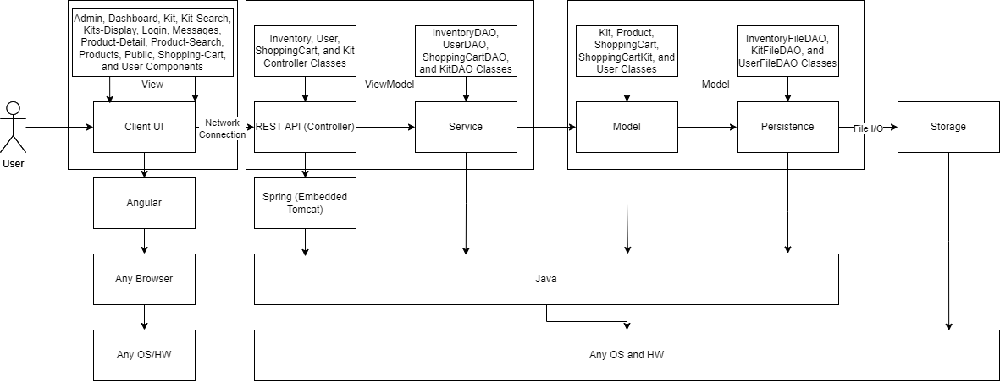

# PROJECT Design Documentation

> _The following template provides the headings for your Design
> Documentation.  As you edit each section make sure you remove these
> commentary 'blockquotes'; the lines that start with a > character
> and appear in the generated PDF in italics but do so only **after** all team members agree that the requirements for that section and current Sprint have been met. **Do not** delete future Sprint expectations._

## Team Information
* Team name: Shake And Pour
* Team members
  * David Dobbins
  * Joshua Bay
  * Duncan French
  * Matthew Morrison
  * Akhil Devarapalli

## Executive Summary

### Purpose
>  _**[Sprint 4]** Provide a very brief statement about the project and the most
> important user group and user goals._

This product is an e-store for a producer of custom drink kits, also known as a mixologist. It is intended to allow customers to search for and purchase drink kits as well as allow the store's administrator to easily manage and update the store's inventory.

### Glossary and Acronyms
> _**[Sprint 4]** Provide a table of terms and acronyms._

| Term | Definition |
|------|------------|
| SPA | Single Page |
| DAO | Data Access Object |
| Kit | Set of drinks in certain quantities |
| Inventory | All currently available drinks | 

## Requirements

This section describes the features of the application.

> _In this section you do not need to be exhaustive and list every
> story.  Focus on top-level features from the Vision document and
> maybe Epics and critical Stories._

### Definition of MVP
> _**[Sprint 4]** Provide a simple description of the Minimum Viable Product._

The MVP consists of a basic login system to allow users and an admin to log into the e-store. The admin will be able to modify the contents of the inventory, while the user will be able to find, view, and purchase drink kits. All of these actions will be reflected by changes to the data stored on the server.

### MVP Features
>  _**[Sprint 4]** Provide a list of top-level Epics and/or Stories of the MVP._

### Enhancements
> _**[Sprint 4]** Describe what enhancements you have implemented for the project._

## Application Domain
> _**[Sprint 4]** Provide a high-level overview of the domain for this application. You
> can discuss the more important domain entities and their relationship
> to each other._

This section describes the application domain.

Owner: This entity represents the individual or group responsible for managing the e-store. They have administrative access, enabling them to add, remove, and edit inventory items, including both products and kits.

E-store: Acts as the digital storefront through which transactions between customers and the business are facilitated. It is the platform where products and kits are displayed for sale.

Inventory: Serves as the collection of all items available for sale within the e-store, including both individual products and kits. The inventory is directly managed by the Owner.

Product: Individual items for sale, each with its own price. Products can be sold as part of a kit.

Kit: A significant addition to the model, a Kit is a bundled group of products sold together at a specific price. Each Kit includes a list of products, making it a convenient option for customers looking for package deals or themed collections.

Customer: Customers are the end-users of the platform, capable of browsing the inventory, adding products and kits to their shopping cart, and making purchases. They interact with the e-store by logging in, searching for items, and checking out.

Shopping Cart: The Shopping Cart is an essential component of the online shopping experience, allowing customers to accumulate a list of items they intend to purchase. Updated to include kits, it tracks both individual products and kits, along with the total price.

Payment Method: This entity facilitates the transaction process, offering customers various options to complete their purchases, including Credit Card, Paypal, and Apple Pay.

## Architecture and Design

This section describes the application architecture.

### Summary

The following Tiers/Layers model shows a high-level view of the webapp's architecture. 
**NOTE**: detailed diagrams are required in later sections of this document.

The web application, is built using the Model–View–ViewModel (MVVM) architecture pattern. 

The Model stores the application data objects including any functionality to provide persistance. 

The View is the client-side SPA built with Angular utilizing HTML, CSS and TypeScript. The ViewModel provides RESTful APIs to the client (View) as well as any logic required to manipulate the data objects from the Model.

Both the ViewModel and Model are built using Java and Spring Framework. Details of the components within these tiers are supplied below.

### Overview of User Interface

This section describes the web interface flow; this is how the user views and interacts with the web application.

> _Provide a summary of the application's user interface.  Describe, from the user's perspective, the flow of the pages in the web application._

### View Tier
> _**[Sprint 4]** Provide a summary of the View Tier UI of your architecture.
> Describe the types of components in the tier and describe their
> responsibilities.  This should be a narrative description, i.e. it has
> a flow or "story line" that the reader can follow._

> _**[Sprint 4]** You must  provide at least **2 sequence diagrams** as is relevant to a particular aspects 
> of the design that you are describing.  (**For example**, in a shopping experience application you might create a 
> sequence diagram of a customer searching for an item and adding to their cart.)
> As these can span multiple tiers, be sure to include an relevant HTTP requests from the client-side to the server-side 
> to help illustrate the end-to-end flow._

> _**[Sprint 4]** To adequately show your system, you will need to present the **class diagrams** where relevant in your design. Some additional tips:_
 >* _Class diagrams only apply to the **ViewModel** and **Model** Tier_
>* _A single class diagram of the entire system will not be effective. You may start with one, but will be need to break it down into smaller sections to account for requirements of each of the Tier static models below._
 >* _Correct labeling of relationships with proper notation for the relationship type, multiplicities, and navigation information will be important._
 >* _Include other details such as attributes and method signatures that you think are needed to support the level of detail in your discussion._

### ViewModel Tier
Our ViewModel Tier is implemented through Java and the REST API ProductController class. The controller 
interacts with the ProductDAO class, which is the service for the project. 

> _**[Sprint 4]** Provide a summary of this tier of your architecture. This
> section will follow the same instructions that are given for the View
> Tier above._

> _At appropriate places as part of this narrative provide **one** or more updated and **properly labeled**
> static models (UML class diagrams) with some details such as critical attributes and methods._
> 

### Model Tier
The Model tier is represented by our Kit, Product, ShoppingCart, ShoppingCartKit, and User classes. These represent data given by the ViewModel tier. These classes create Java objects that are then stored by their corresponding FileDAO classes that then store the data in JSON files. 

> _**[Sprint 3 & 4]** Provide a summary of this tier of your architecture. This
> section will follow the same instructions that are given for the View
> Tier above._

> _At appropriate places as part of this narrative provide **one** or more updated and **properly labeled**
> static models (UML class diagrams) with some details such as critical attributes and methods._
> 

## OO Design Principles

We considered the MVVM architecture and object-oriented design principles while making this diagram, as each class is encapsulated with a certain amount of functions that can all interact with each other to make the product. 

### 1. Single responsibility

Single responsibility is the principle that each class in a program's design should handle exactly one task. This results in smaller, more focused classes and makes code easier to understand and modify. 

We use single responsibility throughout our design, as can be seen in the tiers and layers diagram. In the View tier, each component and service is responsible for implementing a logical set of functionality. For example, the shopping cart component is responsible for displaying the shopping cart and allowing the user to modify its contents. The kit service is responsible for handling API requests related to kits. In the ViewModel tier, each controller is responsible for handling requests related to one group: kits, products, shopping carts, and users. In the Model tier, each data representation class represents 1 type of object: Users, Kits, Products, Shopping Carts, and Shopping Cart Kits. 

### 2. Pure Fabrication

Pure fabrication is the concept that in order to achieve a simple and easy to understand architecture, a system often needs to invent classes or entities that are not part of the domain model. These classes are often managers of data or other objects that are difficult to logically structure without a fabricated class. 

We use pure fabrication throughout our system and it can be seen in our tiers and layers diagram. Our View tier uses services to manage API calls, which are not a stated domain entity. However, by using angular services to manage these calls we allow the functionality to be reused by multiple components. This makes editing and testing code in the View tier much easier. In the ViewModel tier we do the same thing. Controller classes are not domain entities, but by using them we are able to manage calls to the API in a much more structured way. Finally, in the Model Tier, we use FileDAO classes to manage data on the server side. These are again not domain entities, but allows the system to easily handle data management.

### 3. Dependency Inversion 

Dependency inversion is the idea that high-level modules should not depend on low-level modules, and that both should depend on abstractions. Moreover, abstractions should not depend on details; details should depend on abstractions. This leads to a design where the higher-level logic can be indifferent to the low-level module implementation details, promoting module reusability and a more testable system.

Our system’s architecture embodies the Dependency Inversion Principle across its tiers. For example, in the Service tier, rather than depending directly on DAO classes, we define an interface for data operations. This allows the Service layer to interact with any data source that implements these interfaces, which makes our system more flexible and easier to test. In the Model tier, our business objects like Kit, Product, and ShoppingCart are designed to be indifferent towards the specific type of persistence they are used with. This is evident as the Persistence layer uses interfaces to define the necessary operations for data storage and retrieval. This way, the actual file-based DAO implementations in the Persistence tier are details that the Model does not rely on, allowing the potential for different storage mechanisms to be used without significant changes to the Model.

> _**[Sprint 3 & 4]** Will eventually address upto **4 key OO Principles** in your final design. Follow guidance in augmenting those completed in previous Sprints as indicated to you by instructor. Be sure to include any diagrams (or clearly refer to ones elsewhere in your Tier sections above) to support your claims._

> _**[Sprint 3 & 4]** OO Design Principles should span across **all tiers.**_

## Static Code Analysis/Future Design Improvements
> _**[Sprint 4]** With the results from the Static Code Analysis exercise, 
> **Identify 3-4** areas within your code that have been flagged by the Static Code 
> Analysis Tool (SonarQube) and provide your analysis and recommendations.  
> Include any relevant screenshot(s) with each area._

> _**[Sprint 4]** Discuss **future** refactoring and other design improvements your team would explore if the team had additional time._

## Testing
> _This section will provide information about the testing performed
> and the results of the testing._

### Acceptance Testing
> _**[Sprint 4]** Report on the number of user stories that have passed all their
> acceptance criteria tests, the number that have some acceptance
> criteria tests failing, and the number of user stories that
> have not had any testing yet. Highlight the issues found during
> acceptance testing and if there are any concerns._

Note: All stories for sprints 1 & 2 are passing their acceptance criteria
User Stories passing all acceptance criteria: 14
User Stories passing some acceptance criteria: 0
User Stories not under testing yet: 14

### Unit Testing and Code Coverage
> _**[Sprint 4]** Discuss your unit testing strategy. Report on the code coverage
> achieved from unit testing of the code base. Discuss the team's
> coverage targets, why you selected those values, and how well your
> code coverage met your targets._

>_**[Sprint 2 & 4]** **Include images of your code coverage report.** If there are any anomalies, discuss
> those._
> **[Sprint 2 Code Coverage]**
> 
> 
> The main issue with the controller coverage was with the Shopping Cart Controller. Several if statments were not tested when removing or getting kits from the cart. Resulting in the overall less code coverage.
> 
> While our tests did not miss any instructions, there were some missing branches to be tested from all FileDAO classes. More tests just need to be added to account for all cases/branches in if statements of methods.
> 

## Ongoing Rationale
>_**[Sprint 1, 2, 3 & 4]** Throughout the project, provide a time stamp **(yyyy/mm/dd): Sprint # and description** of any _**major**_ team decisions or design milestones/changes and corresponding justification._
2024/02/19: Sprint 1 - Discussion of merging and testing of our sprint 1 demo.
2024/02/20: Sprint 1 - We initially discussed and implemented the tiers and layers diagram with the product classes. This was because it was the main aspect of our implementation in sprint 1 ensuring that the backend can supply. This was however incorrect as we changed it to inventory classes for the API and services.
2024/02/27: Sprint 2 - We met up to clarify our responsibilities for the sprint 2 and discussed our system design for how to implement the user stories. We justified having controllers for Kits, Users, and the Shopping Cart so that their classes hold single responsibility and specify API requests for their individual controllers in the viewmodel.
2024/03/03: Sprint 2 - We discussed the addition of a new story, View Drink Kits, to ensure that only the User and not Admin can view the available drink kits. This was justified through the sprint 2 requirements that an Admin should not be able to view the shopping cart and therefore not be able to view and add products to cart.
2024/03/07: Sprint 2 - We discussed together how to handle user login. We decided to add the login onto User Controller as their information includes their login and password. Initially, we had a separate controller for logging in, however this proved to cause too many issues. This could be changed in future optimization to provide better single responsibility.
2024/03/18: Sprint 2 - We discussed the updates on our architectural tiers and layers document, as well as updating out design documentation. This was justified thorugh our previous conversations on how to implement the user stories for sprint 2 and all added aspects in the view model and model tier.
2024/03/19: Sprint 3 - We conducted our planning poker for sprint 3. We clarified our responsibilities based on the points assigned. Each member has approximately 5 points. This included our final MVP implemenations and our 10% enhancements.
2024/03/26: Sprint 3 - We discussed how we should handle custom kits and checked in on each other's progress for each user story. We completed the Order history DAO and discussed how it will be implemented for certain stories.
2024/04/02: Sprint 3 - We finalized anything that was incomplete and and questions on unfinished user cards. This included things such as order history and custom kits for the e-store.
