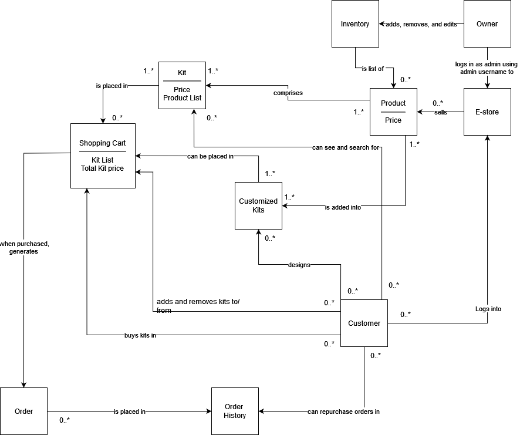
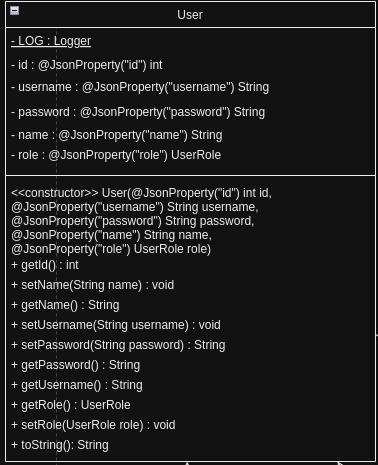
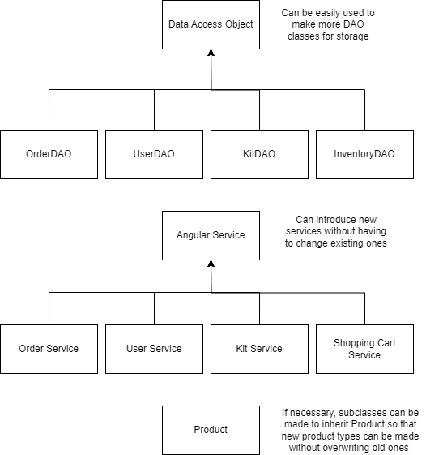

# PROJECT Design Documentation

## Team Information
* Team name: Shake And Pour
* Team members
  * David Dobbins
  * Joshua Bay
  * Duncan French
  * Matthew Morrison
  * Akhil Devarapalli

## Executive Summary

### Purpose

This e-commerce platform is designed for a mixologist's custom drink kits, streamlining the shopping and inventory management experience. Customers can easily find and buy their favorite drink kits, while the store admin can swiftly update inventory. The added features of viewing past orders and re-adding items to the cart makes repeat purchases a breeze. It's a practical, efficient solution for both buyers and sellers in the world of custom drink mixology.

### Glossary and Acronyms

| Term | Definition |
|------|------------|
| SPA | Single Page |
| DAO | Data Access Object |
| MVVM | Model View View-Model architecture |
| API | Application programming interface |
| Product | A drink with a name and price |
| Kit | A set of products in certain quantities |
| Inventory | All currently available drinks | 
| User | A customer who can buy kits from the store |
| Admin | The store owner who can update the inventory and kit listings |

## Requirements
This section describes the features of the application.

### Definition of MVP

The MVP, encompassing a fundamental login system, enables both regular users and an administrator to access the e-store with distinct capabilities. Upon successful login, the admin is empowered to manage the inventory — adding, updating, or removing products and/or drink kits as necessary. Conversely, users are provided with functionalities to browse, search, and select drink kits, which they can then add or remove from their shopping cart to purchase. These interactions, from administrative adjustments to user purchases, are directly mirrored in the server's data files, ensuring persistence and consistency of the e-store's state across sessions. This setup lays the groundwork for a streamlined and user-friendly online shopping environment, prioritizing essential features while setting the stage for future enhancements.

### MVP Features

## **Epic: Buyer**
- **View Drink Kits** - As a buyer I want to be able to browse drink kits and drinks so that I can purchase drink kits which interest me.
- **Filter Kits** - As a buyer I want to be able to search for a drink kit by name so I can find what I’m looking for quickly.
- **Buyer Login** - As a buyer I want to login to my account so I can view products and make a choice if I want to buy the product or not.

## **Epic: Owner/Admin**
- **Edit Inventory** - As an Owner I want to be able to create, update, and delete items in my inventory to keep the inventory up-to-date.
- **Login to Admin View** - As an admin of my e-store I want to login into my e-store with admin rights so that I have permissions to add, delete, and modify products in my inventory.

## **Epic: Cart Management**
- **Add Drinks to Cart** - As a buyer I want to add drink kits to my shopping cart so I can see what I’m planning to buy.
- **Remove Drinks from Cart** - As a buyer I want to be able to remove drink kits from my shopping cart so I can get rid of things I don’t want anymore.
- **Purchase Drink Kits in Cart** - As a user I want to be able to purchase the drink kits in my shopping cart so I can use them.

### Enhancements

The two feature enhancements that we have implemented for this project are customizable drink kits an being able to register an account and view or purchase past orders.
-Customize Order: The project's introduction of customization options for drink kits is a feature enhancement that significantly enriches the user experience. This feature allows customers to add a personal touch to their purchases by selecting from a variety of customization choices, aligning the product with their individual preferences. E-store owners can now dynamically update and manage these options, providing a responsive and engaging shopping platform that caters to the unique desires of each customer.

-Register User/Order History: With the new registration capability, customers gain the advantage of easily managing their order history and simplifying repeat purchases. Once registered, users can review their past orders and with just a few clicks, either add select items or entire previous orders directly into their shopping cart for repurchase. This not only enhances the shopping experience by making it more efficient but also encourages customer loyalty by recognizing and facilitating their buying preferences.

## Application Domain

This section describes the application domain.

MVP:

Owner: This entity represents the individual or group responsible for managing the e-store. They have administrative access, enabling them to add, remove, and edit inventory items, including both products and kits.

E-store: Acts as the digital storefront through which transactions between customers and the business are facilitated. It is the platform where products and kits are displayed for sale.

Inventory: Serves as the collection of all items available for sale within the e-store, including both individual products and kits. The inventory is directly managed by the Owner.

Product: Individual items for sale, each with its own price. Products can be sold as part of a kit.

Kit: A significant addition to the model, a Kit is a bundled group of products sold together at a specific price. Each Kit includes a list of products, making it a convenient option for customers looking for package deals or themed collections.

Customer: Customers are the end-users of the platform, capable of browsing the inventory, adding kits to their shopping cart, and making purchases. They interact with the e-store by logging in, searching for items, and checking out.

Shopping Cart: The Shopping Cart is an essential component of the online shopping experience, allowing customers to accumulate a list of items they intend to purchase. Updated to include kits, it tracks both individual products and kits, along with the total price.

Kit List: Contained within a Shopping Cart, the Kit List is a catalog of all the kits that a customer intends to purchase. This list details each kit's contents and price, contributing to the total price calculation for the shopping cart.

Total Kit Price: This is the sum of the prices of all the kits present in a Shopping Cart. It provides a quick reference for customers to know how much the kits will cost as part of their overall purchase before final checkout.

Product List: An attribute of the Kit entity, the Product List outlines all the individual products included within a kit. It serves to detail what customers will receive when purchasing a kit, ensuring transparency and allowing customers to verify the contents before making a decision.

Feature Enhancements:

Customized Kits: This entity allows customers to create personalized product combinations tailored to their preferences. Customized kits empower users to design and buy kits that contain a selection of products of their choosing, providing a personalized shopping experience.

Order: Represents a completed purchase by a customer. When a shopping cart's contents are finalized and paid for, an Order is generated. This entity captures all relevant details of the transaction, including the customer's information, the purchased items, and the total price.

Order History: This component is a record of all past purchases made by a customer. It enables customers to view their transaction history, track previous orders, and facilitates easy repurchasing of the same products or kits. It provides a valuable reference for both the customer and the business for repurchases, customer service, and order tracking.

## Architecture and Design

This section describes the application architecture.

### Summary

The following Tiers/Layers model shows a high-level view of the webapp's architecture. 

The web application, is built using the Model–View–ViewModel (MVVM) architecture pattern. 

The Model stores the application data objects including any functionality to provide persistance. 

The View is the client-side SPA built with Angular utilizing HTML, CSS and TypeScript. The ViewModel provides RESTful APIs to the client (View) as well as any logic required to manipulate the data objects from the Model.

Both the ViewModel and Model are built using Java and Spring Framework. Details of the components within these tiers are supplied below.

### Overview of User Interface
<!-- _Provide a summary of the application's user interface.  Describe, from the user's perspective, the flow of the pages in the web application.-->

The user is first directed to the login page. Here, they can either log into the store using a username and password that they already created or they can register with their name and their desired username and password. Ordinary users log in with their own credentials, but the store owner can log in using the reserved username "admin" and their own password. 

Upon logging in as an ordinary user, the user will see a home page displaying their name and the option to change their username, password, name, or view their order history. Additionally, they will see a bar of buttons on the top of the page with links to pages allowing them to view the kits available for purchase, their current shopping cart status including the kits they've bought and how much they cost, the user page that they're currently on, a page to create custom kits for purchase, and an option to log out. Upon navigating to any of these pages, they will still see the top bar of buttons along with any content specific to that page.

Upon logging in as an admin, the store owner is directed to the administrator dashboard. Here they are presented with the option to add a new product, edit an existing product, or delete an existing product. These 3 options also exist for drink kits. Similar to an ordinary, the admin also has a bar of buttons displayed at the top of the page to allow them to navigate the store. They can visit the dashboard, which contains products and has the ability to search for a product by name. They can visit a special products page which allows them to quickly view, add, and delete products in the inventory. They can also go to the admin dashboard, the same page they are directed to on logging in, and they can log out.

### View Tier
The View Tier of the Shake and Pour website consists of sixteen components, each with specific roles in managing the user interface and interactions. These components handle tasks such as user authentication, product management, order history, shopping cart management, and debugging. Together, they form a cohesive system that facilitates user navigation and interaction within the e-store environment.

 To begin, there are the admin, user, and login components. Both admin and user components share similar functionalities, facilitating communication with the backend to modify personal details and view order histories. They also handle routing to other pages or components for seamless navigation. However, the admin component additionally interacts with the backend to manage kits, while the login component manages user authentication.

Next, the register and custom-kit components facilitate the creation of new user accounts or custom kits, respectively. They gather necessary information and communicate with the backend to add this data.

For admins, the products, product-detail, and product-search components come into play. The products component showcases each product and manages backend interactions for adding and deleting products. The product-detail component displays detailed information about each product, while the product-search component handles search functionality and result display.

Kits serve as the cornerstone of the e-store, facilitating product purchases. The kit, kit-search, and kit-display components are involved. The kit component retrieves kit information, while kit-search enables product searches and displays results accordingly. Kit-display focuses solely on presenting kits, all of which are showcased on the dashboard component, the central hub for Shake and Pour users.

Every user has access to their order history, managed by the orders and order-search components. Orders communicates with the backend to retrieve and display past orders, while order-search offers search functionality and result display.

The shopping cart component contains selected kits and manages interactions exclusively for users. It communicates with the backend to add or remove items and dictates cart display.

Lastly, the message component serves primarily for debugging during development, functioning akin to a console log. While it can be easily re-enabled for development purposes, it is disabled in the live version of Shake and Pour.

#### The Login Functionality Sequence Diagram

#### Add to Cart Functionality Sequence Diagram

### ViewModel Tier
Our ViewModel Tier is implemented through Java and the REST API ProductController class. The controller 
interacts with the ProductDAO class, which is the service for the project. 

- Inventory Controller
  * Inventory Controller handles HTTP requests relating to the management of the inventory of all products in our e-store.
  * For a User, the Inventory Controller handles requests for searching and getting products that are available.
  * For the admin, the Inventory Controller handles requests relating to the creation, deletion , and updating of products in the store.
  * **Endpoints:**
      - GET /inventory?name=: searches for any products that have the following text or name
      - POST /inventory/product: create a new product and add it to the store
      - PUT /inventory: update a product with new information (used as a new product class object)
      - GET /inventory: Get every product in the inventory
      - GET /inventory/product/{id}: get a specific product based on its id, if it exists
      - DELETE /inventory/product/{id}: delete a specific product based on its id, if it exists

- Kit Controller
  * Kit Controller handles HTTP requests relating to the management of the kits in our e-store.
  * For a User, the Kit Controller handles requests for searching, creating (custom kits), and get kits that are available.
  * For the admin, the Kit Controller handles requests relating to the creation, deletion, and updating of kits in the store.
  * **Endpoints:**
      - POST /kits/create: Create a new kit object and add to inventory or to cart (if user makes a custom kit)
      - GET /kits?name=: searches for any kits that have the following text or name
      - GET /kits: get every kit that is on the store/site
      - GET /kits/{id}: get a specific kit based on its id, if it exists
      - PUT /kits: update a kit with new information (as a new kit class object)
      - DELETE /kits/{id}: delete a specific kit based on its id, if it exists
        
- Order Controller
  * Order Controller handles HTTP requests relating to the management of orders and order history in our e-store. This manages updating and getting a customer's order history for a specified user.
  * The controller includes request to get the order history of a user, searching thorugh that user's order history, added to a user's order history, and getting a specific order by id.
  * **Endpoints:**
      - POST /orders/create?username=&kitsJson=: create a new order for a user based on their username and kits that were purchased in that order (saved as a json string through the front end)
      - GET /orders/{name}/?user=: search all the orders and a user's order history through their username with a specific substring of text provided by that user
      - GET /orders?user=: get all the orders and a user's order history based on their username
      - GET /orders/getSpecific/{id}: get a specific order based on its id, if it exists
   
- Shopping Cart Controller
  * Shopping Cart Controller handles all operations for a user's shopping cart.
  * This includes methods to add a kit to a user's cart, remove from cart, get kits in the cart, caluculate total cost, and clearing the cart
  * **Endpoints:**
      - POST /cart/add/{userId}/{id}/{quantity}: add a kit to a user's specific shopping cart based on the quantity requsted by the user
      - DELETE /cart/remove/{userId}/{id}/{quantity}: remove a specific amount of a kit from the user's shopping cart, if it already exists in the shop
      - GET /cart/{userid}: Retrienve a user's kits in cart, excluding the products within the cart
      - GET /cart/fullkits/{userId}: Retrienve a user's kits in cart, including all relevant information of the kit, including all products within the kit
      - GET /cart/total/{userId}: Calculate the total cost of a user's cart based on all the kits currently in their cart
      - DELETE /cart/clear/{userId}: clear out a user's cart to be empty, if it is not already empty
   
- User Controller
  * User Controller handles all requests and operations that pertain to a single user in the e-store. This includes being able to register or sign in to the store account, editing information about the user, and getting/deleting users from the e-store
  * **Endpoints:**
      - POST /users/register?username=&password=&name=: Register a new user to the e-store provided with a username (must be unique), password, and name
      - GET /users/getById/{id}: get a specific user based on their user ID
      - GET /users/getByUsername/{username}: get a specific user based on their username
      - PUT /users/update/{id}/u?username=: update a user's username, provided that it does not already exist in the store
      - PUT /users/update/{id}/p?password=: update a user's password
      - PUT /users/update/{id}/n?name=: update the name of the user
      - DELETE /users/delete/{id}: delete a user from the store based on their user id
      - POST /users/login?username=&password=: attempt to login a user to the store, provided they input their correct username and password
  * Inside the User Controller, we also created a login response that helps return a message to the front end UI when a user attempts to login:
      - LoginResponse (constructor): creates a new LoginResponse object based on the login HTTP method
      - GETTERS: getUserId, getUserType (needed to display correct page), getMessage

### Model Tier
The Model tier is represented by our Kit, Product, ShoppingCart, ShoppingCartKit, User, and Order classes. These represent data given by the ViewModel tier. These classes create Java objects that are then stored by their corresponding FileDAO classes that then store the data in JSON files.

**Product Model**: The product model is the core model that is used to build a kit model. The product model represents a singular product in our estore. The product model contains the following information about a certain product: products name, price, the quantity of the product in inventory, and the id of the product. The model also contains methods to access of this said information as well as update the name, price, and the quantity of the product in inventory.
#### The UML for the Product Model

 
**Kit Model**: A kit on the estore is made up of one or more products and this is reflected in the design of the kit model class. While the kit model class does not hold any actual product models, it contains the ids of the products which you would reviece if you where to order a kit. The kit model class contains the following information, the id of the kit, the name of the kit, the price of the kit, the quantity of the kit remaining in inventory, and the ids' of the products that make up the kit. There are methods to access the kit's name, price, quantity in inventory, and the ids' of the products that make up that kit. There are also methods to modify the name of the kit, its price, quantity in inventory, and the products that make up the kit.
#### The UML for the Kit Model

**User Model**: The user is the person who uses the estore and depending on their role they can do a range of things from adding items to shopping cart to modifying inventory. The user model contains the following information: the user id, the username, the user's password, the user's name, the and role of the user. There are methods which allows one to access all the preivously stated information about the user. There are also methods to modify and set the user's name, password, username, and role. 
#### The UML for the User Model

**ShoppingCart Model**: The shopping cart model represents the estore's actual shopping cart. User's will add different instances of the kit model to the ShoppingCart model. The ShoppingCart model will then hold these kit instance in a map with the Kit instance being the key and the integer being the quantity of this kit in the shopping cart. The ShoppingCart has methods which allow you to add kits to the shopping cart, remove kits from the shopping cart, clear the shopping cart, see if a kit exists in the current shopping cart, and get the total price of all the kits in the shopping cart. 
#### The UML for the ShoppingCart Model

**ShoppingCartKit Model**: The ShoppingCartKit model was designed as a helper class so that information that we did not want to show the user was hidden. With the ShoppingCart model class every ascpect and infomration about a kit was shown in the actual shopping cart, this includes the products that make up the kit. We did not want users to see these products as it may confuse. Thus a design decision was made to hide this information from the front end by modifiying the backend. The ShoppingCartKit model class has methods to retreive the kit name, kit price, and quantity of this specific kit within the shopping cart itself. However, it does not have any methods to modify these values. 
#### The UML For the ShoppingCartKit Model

**Order Model**: The order model represent the past orders/shopping carts a specicfic user ordered. The class has the following follwing information the id of the order, the name of the user who ordered that order, and the kits within that order. There are methods within the class to access all the previously stated information. There are also methods which can set the name of the user who purchased the order, clear kits from the order, and add kits to the order. 
#### The UML for the Order Model

## OO Design Principles

We considered the MVVM architecture and object-oriented design principles while making this diagram, as each class is encapsulated with a certain amount of functions that can all interact with each other to make the product. 

### 1. Single responsibility

Single responsibility is the principle that each class in a program's design should handle exactly one task. This results in smaller, more focused classes and makes code easier to understand and modify. 

We use single responsibility throughout our design, as can be seen in the tiers and layers diagram. In the View tier, each component and service is responsible for implementing a logical set of functionality. For example, the shopping cart component is responsible for displaying the shopping cart and allowing the user to modify its contents. The kit service is responsible for handling API requests related to kits. In the ViewModel tier, each controller is responsible for handling requests related to one group: kits, products, shopping carts, and users. In the Model tier, each data representation class represents 1 type of object: Users, Kits, Products, Shopping Carts, and Shopping Cart Kits. 

### 2. Pure Fabrication

Pure fabrication is the concept that in order to achieve a simple and easy to understand architecture, a system often needs to invent classes or entities that are not part of the domain model. These classes are often managers of data or other objects that are difficult to logically structure without a fabricated class. 

We use pure fabrication throughout our system and it can be seen in our tiers and layers diagram. Our View tier uses services to manage API calls, which are not a stated domain entity. However, by using angular services to manage these calls we allow the functionality to be reused by multiple components. This makes editing and testing code in the View tier much easier. In the ViewModel tier we do the same thing. Controller classes are not domain entities, but by using them we are able to manage calls to the API in a much more structured way. Finally, in the Model Tier, we use FileDAO classes to manage data on the server side. These are again not domain entities, but allows the system to easily handle data management.

### 3. Dependency Inversion 

Dependency inversion is the idea that high-level modules should not depend on low-level modules, and that both should depend on abstractions. Moreover, abstractions should not depend on details; details should depend on abstractions. This leads to a design where the higher-level logic can be indifferent to the low-level module implementation details, promoting module reusability and a more testable system.

Our system’s architecture embodies the Dependency Inversion Principle across its tiers. For example, in the Service tier, rather than depending directly on DAO classes, we define an interface for data operations. This allows the Service layer to interact with any data source that implements these interfaces, which makes our system more flexible and easier to test. In the Model tier, our business objects like Kit, Product, and ShoppingCart are designed to be indifferent towards the specific type of persistence they are used with. This is evident as the Persistence layer uses interfaces to define the necessary operations for data storage and retrieval. This way, the actual file-based DAO implementations in the Persistence tier are details that the Model does not rely on, allowing the potential for different storage mechanisms to be used without significant changes to the Model.

For Sprint 3, we improved our submission by adding a design principle UML diagram that clearly describes how our project adheres to Object Oriented principles. We didn't have a diagram in the last sprint, and our explanations for each principle were a bit unclear. We fixed this by discussing how to elaborate on our decisions, and made a diagram together to submit for sprint 3. 

### 4. Open/Closed

The Open/Closed Principle states that software entities (classes, modules, functions, etc.) should be open for extension but closed for modification. This means that the behavior of a module can be extended without modifying its source code, which is often achieved by using interfaces or abstract classes that can be subclassed. In the persistence layer, the use of Data Access Object classes such as InventoryFileDAO, KitFileDAO, and UserFileDAO shows a design where the concrete implementation of how data is persisted can vary, but the interface remains consistent. If the system were to transition from file storage to database storage, for instance, new DAO classes could be created to extend the current functionality without changing the client code that relies on these DAOs. The services interfacing with the DAOs adhere to a set of interfaces that define the contract for interaction. The system can introduce new service implementations for different contexts, which extend the base service functionality without altering the existing service interface or its consumers. The Model tier, which includes domain classes like Kit, Product, and ShoppingCart, is designed in such a way that it can easily adapt to changes in the way objects are created or managed. For example, if a new type of Product needs to be introduced, it can be done by creating a new subclass that inherits from the Product class, thus extending its functionality without altering the original Product class. By adjourning to the Open/Closed principle, the software architecture is more flexible and can adapt to new classes without having to change existing ones. This also reduces the risk of bugs while changing older classes.

## Static Code Analysis/Future Design Improvements

### Static Code Analysis Area 1

The first major issue that SonarQube detected was the issue that we see in the screenshot above. The variable nextId keeps track of the id number for the next product that we add to the inventory. This number should remain constant throughout every instance of the KitFileDAO class. As a result, this variable is static. However, the load() is not static, which can cause issues if this class is instantiated multiple times. We did not notice this issue when developing the application because we only had to instantiate this class once. This issue is present in all DAO classes in the project and should be fixed the next time the code is refactored. The simplest and most effective solution to this is to give nextId an initial value in the class declaration and remove the assignment from the load() method.

### Static Code Analysis Area 2

The next issue SonarQube detected was that in the codebase the string “PUT /users/update” was being used multiple times and then variables were concatenated to the string depending on what path we were going down. If we want to change this path in the future as we create more features or update our application we have to change this literal string in every part of the codebase that it appears in. Currently, it appears in 3 different paths for our application. As we add more features it has the potential to appear in other paths as well. In order to fix this we should create a variable that has the value of “PUT /users/update” and use this variable in the place of the string literal. If we ever need to change this path, this solution will ensure that we only have to change the value in only one place rather than multiple places within the codebase. Doing this will allow for consistent logging and consistent logging leads to better analytics and an easier time diagnosing problems. 

### Static Code Analysis Area 3

This is one of the few portions of the code base that was flagged by sonarqube for potential performance issues. Some method calls that are evoked effectively do nothing. However, if the method does effectively nothing, the arguments that are passed in still need to be evaluated before the method is called. By passing in concatenated strings into the logger we will start to take performance hits. We really do not want these performance hits and we only want to be logging actions in production code whenever something fails or we receive errors. The way which we are doing it now everything is logged, which could lead to slower execution times. However, only logging when things fail or when there is an error is not ideal. Therefore, we should use different methods to log actions in order to ensure better performance. One way we could do this is to only log things useful for debugging purposes when we have debug enabled. This ensures that logs that are used for debugging are not being executed in production code, thus reducing performance hits. Another thing which we could do, which is suggested by sonarqube, is to use the Java supplier method, which has been available since Java 8. The supplier evaluates the method lazily which leads to a significantly less hit on performance. We did not pay much attention to the performance hits that debugging could possibly bring, mainly because our application was not being deployed on a large scale. 

### Static Code Analysis Area 4

The above error is the only reliability issue flagged by sonarqube for the angular front end of the estore-ui. In this code we were trying to change the username of the user to whatever they want their new user name to be. In this instance we want the username for this session to be changed. However, in order to do this we are redeclaring the username variable that was already declared previously in the file. This statement which we have created does not serve our purpose effectively. We could have easily changed the user name by just setting this.username = username. We are now simply changing the value instead of re-declaring the variable. If we wanted to do the way which is already in the code we needed to call a function. Refactoring the code for issues like this would be a helpful next step. 

### Future Refactoring and Design Improvements
If our team had additional time there are several elements of the code which we would consider refactoring. To start off we would most likely refactor our logging on the backend. We would refactor the code to only do debug logging whenever debugging is enabled and only log actions whenever something fails in production. This will ensure that when our application scales we will not take any performance hits due to logging. Next we will ensure that nextId elements are initialized in the class declaration and not assigned in non-static methods across all DAO file classes to ensure that we will get no conflicts with id numbering even if we were to have multiple instances of the DAO class. Again we did not take this into consideration as our current application only has one instance of each DAO class. Next we will clean up a lot of import statements which have modules and files that are not being used. This issue made up a majority of the low level flags from sonarqube for both the ui and api. We imported these files and packages when we were first building the application in order to test and try different solutions. Once we found a solution to one of our tickets we never removed the packages that were not being used before we pushed the code out. Finally one last thing which we would do is clean up the comments as some comments are outdated, and TODO tags still exist even though the solution has already been implemented. 

## Testing

### Acceptance Testing
End of Sprint 2 Acceptance Testing (All stories for sprints 1 & 2 are passing their acceptance criteria)
User Stories passing all acceptance criteria: 14
User Stories passing some acceptance criteria: 0
User Stories not under testing yet: 14

Sprint 4 Acceptance Testing: 
User Stories passing all acceptance criteria: 28
User Stories passing some acceptance criteria: 0
User Stories not under testing yet: 0 

### Unit Testing and Code Coverage
For our project, we aimed for a target that is generally considered industry standard. We aimed for a complete code coverage of 95% or higher for this application. The follwoing sections break down the code coverage for each area of our application's code. 

#### Model layer:
Our target goal for this Layer was 100%. We achieved **97% coverage**, missing instructions mainly in the `Order` and `User.UserRole` elements. While not at 100%, it's very close to our target, indicating a high degree of test completeness for the foundational data structures of our application.

#### Persistence layer:
Our target goal for this layer was 95%. We achieved **99% coverage**, surpassing our target. This suggests that our tests are effectively exercising the code responsible for data storage and retrieval operations. A closer look at missed branches, particularly in `KitFileDAO` and `InventoryFileDAO`, will be needed to ensure no critical edge cases are overlooked.

#### Controller layer:
Our target for this layer was 90%. We achieved **99% coverage**, exceeding our target. This is excellent, indicating comprehensive testing of the application's business logic and request handling. The `ShoppingCartController` has slightly lower branch coverage at 93%, suggesting there may be some conditional logic that isn't fully tested.

Overall, the code coverage met or exceeded our targets in most areas, reflecting a robust testing regime. Our overall code coverage well exceeded the 90% target set for this application. However, there are some missed branches and instructions noted, which highlights areas for improvement. It's essential to review these gaps, as they may point to untested scenarios that could impact the application's stability or reveal potential bugs. Improving the test cases to cover these areas will ensure higher reliability and maintainability of the code base.

**[Sprint 2 Code Coverage]**

The main issue with the controller coverage was with the Shopping Cart Controller. Several if statments were not tested when removing or getting kits from the cart. Resulting in the overall less code coverage.

While our tests did not miss any instructions, there were some missing branches to be tested from all FileDAO classes. More tests just need to be added to account for all cases/branches in if statements of methods.

**[Sprint 4 Code Coverage]**

## Ongoing Rationale
- 2024/02/19: Sprint 1 - Discussion of merging and testing of our sprint 1 demo.
- 2024/02/20: Sprint 1 - We initially discussed and implemented the tiers and layers diagram with the product classes. This was because it was the main aspect of our implementation in sprint 1 ensuring that the backend can supply. This was however incorrect as we changed it to inventory classes for the API and services.
- 2024/02/27: Sprint 2 - We met up to clarify our responsibilities for the sprint 2 and discussed our system design for how to implement the user stories. We justified having controllers for Kits, Users, and the Shopping Cart so that their classes hold single responsibility and specify API requests for their individual controllers in the viewmodel.
- 2024/03/03: Sprint 2 - We discussed the addition of a new story, View Drink Kits, to ensure that only the User and not Admin can view the available drink kits. This was justified through the sprint 2 requirements that an Admin should not be able to view the shopping cart and therefore not be able to view and add products to cart.
- 2024/03/07: Sprint 2 - We discussed together how to handle user login. We decided to add the login onto User Controller as their information includes their login and password. Initially, we had a separate controller for logging in, however this proved to cause too many issues. This could be changed in future optimization to provide better single responsibility.
- 2024/03/18: Sprint 2 - We discussed the updates on our architectural tiers and layers document, as well as updating out design documentation. This was justified thorugh our previous conversations on how to implement the user stories for sprint 2 and all added aspects in the view model and model tier.
- 2024/03/19: Sprint 3 - We conducted our planning poker for sprint 3. We clarified our responsibilities based on the points assigned. Each member has approximately 5 points. This included our final MVP implemenations and our 10% enhancements.
- 2024/03/26: Sprint 3 - We discussed how we should handle custom kits and checked in on each other's progress for each user story. We completed the Order history DAO and discussed how it will be implemented for certain stories.
- 2024/04/02: Sprint 3 - We finalized anything that was incomplete and and questions on unfinished user cards. This included things such as order history and custom kits for the e-store.
- 2024/04/04: Sprint 4 - We discussed what is left to complete in our design documentation and presentation and tasked all of us with a section/part of the work remaining.
